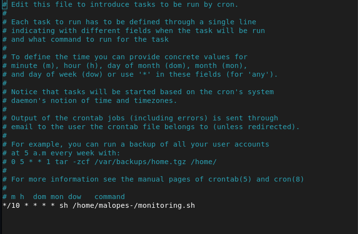

# ⏰ Crontab

:::tip[O que é crontab❓]
 É um gestor de processos de fundo. Os processos especificados serão executados no momento que especificar no arquivo crontab
 :::

 Para termos a crontab correctamente configurada, devemos editar o ficheiro crontab com o seguinte comando: `sudo crontab -u root -e`.

 No arquivo devemos adicionar o seguinte comando para que o script seja executado de 10 em 10 minutos */10 * * * * sh /rota del script.

 

 Funcionamento de cada parâmetro da crontab:

m -➤ Corresponde ao minuto em que o script será executado, o valor varia de 0 a 59.

h -➤ A hora exacta, o formato de 24 horas é utilizado, os valores variam entre 0 e 23, sendo 0 às 12:00 da meia-noite.

dom -➤ Refere-se ao dia do mês, por exemplo, pode especificar 15 se quiser correr todos os 15 dias.

dow -➤ Significa o dia da semana, pode ser numérico (0 a 7, onde 0 e 7 são domingo) ou as 3 primeiras letras do dia em inglês: mon, tue, tue, wed, thu, fri, sat, sun.

user -➤ Definir o utilizador que vai executar o comando, pode ser o root, ou outro utilizador desde que tenha permissões para executar o script.

command -➤ Refere-se ao comando ou caminho absoluto do script a ser executado.

 
