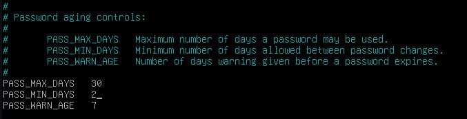
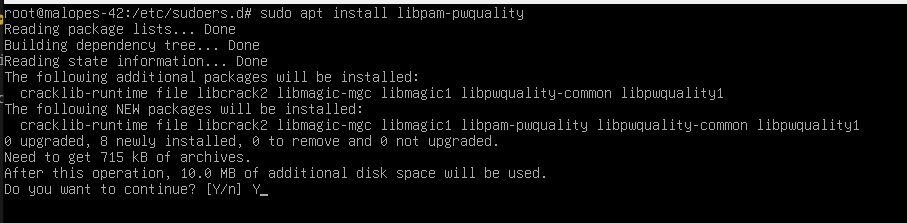
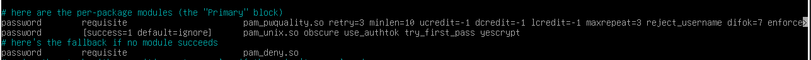
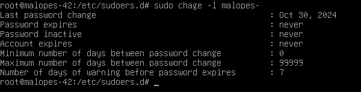
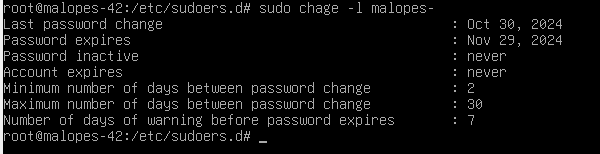

# Configurações de política de senhas fortes 🔑

1. O primeiro passo é a edição do ficheiro login.defs.

2. Uma vez que estamos a editar o ficheiro, modificaremos os seguintes parâmetros:
- PASS_MAX_DAYS 99999 -> PASS_MAX_DAYS 30
- PASS_MIN_DAYS 0 -> PASS_MIN_DAYS 2



```bash
PASS_MAX_DAYS: # Este é o tempo de expiração da palavra-passe. O número corresponde a dias.

PASS_MIN_DAYS: # O número mínimo de dias permitido antes de alterar uma palavra-passe.

PASS_WARN_AGE: # O utilizador receberá uma mensagem de aviso indicando que o número de dias especificado permanece até a sua senha expirar.
```

3.  Para continuar com a configuração temos de instalar os seguintes pacotes com este comando `sudo apt install libpam-pwquality`, depois colocar Y para confirmar a instalação e esperar que termine.
```bash
# A libpam-pwquality é uma biblioteca que faz parte do PAM (Pluggable Authentication Modules), um sistema usado para gerenciar autenticação no Linux. 
# Essa biblioteca é usada para forçar requisitos de complexidade de senha. Com ela instalada e configurada, você pode definir políticas de senha que ajudem a garantir que as senhas dos usuários sejam fortes e difíceis de adivinhar.
```



4. A próxima coisa a fazer é voltar atrás e editar um ficheiro e modificar algumas linhas. Faremos `nano /etc/pam.d/common-password`
Na linha de password requisite apos retry=3 colocaremos os seguintes comandos:
```bash
minlen=10 # O número mínimo de caracteres que a senha deve conter.
ucredit=-1 # Deve conter pelo menos uma letra maiúscula. Colocamos o - como deve conter pelo menos um caracter, se colocarmos + queremos dizer no máximo esses caracteres.
dcredit=-1 # Deve conter pelo menos um dígito.
lcredit=-1 # Deve conter pelo menos uma letra minúscula.
maxrepeat=3 # Não se pode ter o mesmo carácter mais de 3 vezes seguidas.
reject_username # Não pode conter o nome do utilizador.
difok=7 # Deve ter pelo menos 7 caracteres que não façam parte da senha antiga.
enforce_for_root #  Iremos implementar esta política para o utilizador de raiz.
```


:::danger[danger]
A política de palavras-passe recentemente implementada afecta apenas os novos utilizadores. Portanto, é necessário atualizar as contas de utilizador que foram criadas antes desta política para cumprir os novos requisitos de segurança. Para verificar se o utilizador não está em conformidade com a política, vamos utilizar o comando sudo `chage -l username`.
:::



5. Se verificarmos que este utilizador não cumpre a política devemos modificar o número mínimo e máximo de dias entre alterações de password, para isso vamos utilizar o seguinte comando: `sudo chage -m <time> <username> e sudo chage -M <time> <username>`.

```bash
# sudo chage -m 2 malopes-
# sudo chage -M 30 malopes-
# -m é para o número mínimo de dias e -M para o número máximo de dias.
```


