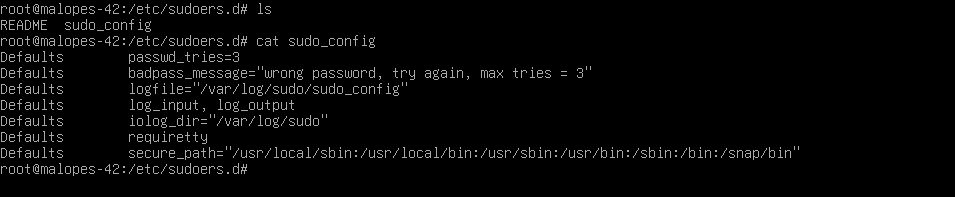

# 🔒 Configuração de senha forte para o sudo

## Configurações de password para sudo

1. Vamos criar um arquivo no caminho `/etc/sudoers.d/.` Decidi chamar o arquivo de `sudo_config`, pois é aqui que a configuração da senha será armazenada. O comando exato para criar o ficheiro é `touch /etc/sudoers.d/sudo_config`.
Colocarei o texto abaixo neste arquivo de configuração e o que cada comando faz:

```js
Defaults  passwd_tries=3 //Quantidade de tentativas maximas de senha colocada errada
Defaults  badpass_message="Mensagem de error personalizado" //Mensagem para caso coloque a senha incorreta
Defaults  logfile="/var/log/sudo/sudo_config" //Arquivo que armazena todos os comando sudo
Defaults  log_input, log_output //Para que todos os comandos sudo executados sejam arquivados no diretório especificado
Defaults  iolog_dir="/var/log/sudo" //Para que todos os comandos sudo executados sejam arquivados no diretório especificado
Defaults  requiretty // Ativa o modo TTY ("requiretty é uma configuração que exige um terminal ativo para executar sudo, bloqueando o uso de sudo em scripts e sessões automáticas quando ninguém está presente.")
Defaults  secure_path="/usr/local/sbin:/usr/local/bin:/usr/sbin:/usr/bin:/sbin:/bin:/snap/bin"
// Essa configuração impede que um atacante adicione comandos maliciosos em diretórios customizados no PATH do usuário para serem executados com sudo.
//É uma camada adicional de segurança, assegurando que sudo sempre use apenas comandos de locais reconhecidos pelo sistema.
```




