# 📜 Script

## Script para log de informações

:::warning[Se Liga]
Esta é uma parte muito importante do projeto. Deve prestar atenção a tudo, muito importante não copiar e colar diretamente o arquivo sem saber o que faz o quê. Na avaliação, deve explicar cada comando se o avaliador o pedir.
:::

:::tip[🧠 O que é um script❓]
É uma sequência de comandos armazenados num arquivo que, quando executado, fará a função de cada comando.
:::

#### Arquitetura

Para ver a arquitetura do SO e a sua versão do kernel utilizaremos o comando `uname -a` *("-a" == "--all" )* que basicamente imprimirá toda a informação excepto se o tipo de processador for desconhecido ou a plataforma de hardware.

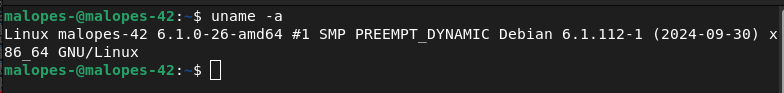

#### Núcleos físicos
Para exibir o número de núcleos físicos, faremos uso do arquivo `/proc/cpuinfo` que fornece informações sobre o processador: o seu tipo, marca, modelo, desempenho, etc. Utilizaremos o comando `grep "physical id" /proc/cpuinfo | wc -l` com o comando grep procuraremos dentro do ficheiro "physical id" e com wc -l contaremos as linhas do resultado do grep. Fazemo-lo porque a forma de quantificar os núcleos não é muito comum. Se houver um processador, marcará 0 e se houver mais do que um processador, mostrará toda a informação do processador separadamente contando os processadores usando notação zero. Desta forma, contamos simplesmente o número de linhas, pois é mais conveniente quantificá-lo desta forma.

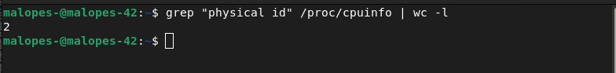

#### Núcleos virtuais
Mostrar o número de núcleos virtuais é muito semelhante ao anterior. Utilizaremos novamente o arquivo `/proc/cpuinfo`, mas, neste caso, utilizaremos o comando `grep processor /proc/cpuinfo | wc -l`. A utilização é praticamente a mesma que a anterior, excepto que em vez de contarmos as linhas físicas de id, iremos contar as linhas do processador. Fazemos desta forma pela mesma razão que anteriormente, a forma de quantificar marcas 0 se houver um processador.

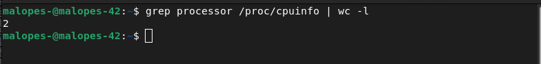

#### Memória RAM
Para exibir a memória da vm utilizaremos o comando free para ver num relance informações sobre a vm, a peça usada, free, reservada para outros recursos, etc. Para mais informações sobre o comando utilizaremos free --help. Utilizaremos `free --mega` porque no subject existe essa unidade de medida (Megabyte). É importante usar --mega e não -m. Com -m referir-nos-emos à unidade de medida Mebibyte e esta não é a especificada no subject.

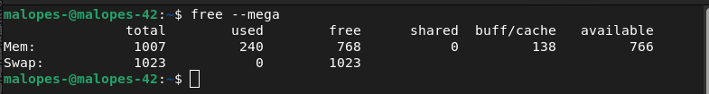

Uma vez executado este comando, devemos filtrar a nossa pesquisa uma vez que não precisamos de toda a informação que nos dá, a primeira coisa que devemos mostrar é a memória utilizada, para isso utilizaremos o comando awk, o que este comando faz é processar dados com base em arquivo de texto, ou seja, podemos utilizar os dados que nos interessam no arquivo X. O que faremos é comparar se a primeira palavra de uma linha for igual a "Mem:" imprimiremos a terceira palavra dessa linha que será a memória utilizada. O comando completo em conjunto seria `free --mega | awk '$1 == "Mem:" {print $3}'`. No script, o valor de retorno deste comando será atribuído a uma variável que será concatenada com outras variáveis, para que tudo se mantenha igual ao especificado no subject.

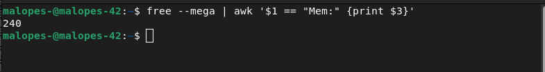

Para obter a memória total, o comando é praticamente o mesmo que o anterior, a única alteração é que em vez de imprimir a terceira palavra da linha, queremos a segunda palavra `free --mega | awk '$1 == "Mem:" {print $2}'`.

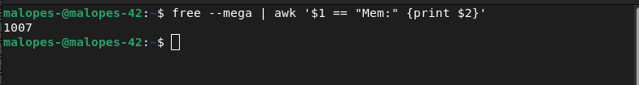

Por último, precisamos calcular a % de memória utilizada. O comando é novamente semelhante aos anteriores, a única modificação que faremos está na parte da impressão. Como a operação para obter a porcentagem não é exata, pode dar-nos muitas casas decimais e no subject apenas 2 são mostradas, pelo que faremos o mesmo, por isso utilizamos %.2f para que apenas 2 casas decimais sejam mostradas. Outra coisa que talvez não saiba é que na impressão para mostrar um % tem de colocar %%. O comando completo `free --mega | awk '$1 == "Mem:" {printf("(%.2f%%%%)\n", $3/$2*100)}'`.

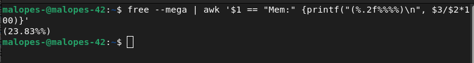

#### Memória em disco

PPara ver a memória de disco ocupada e disponível, utilizaremos o comando `df` que significa "sistema de arquivo de disco", que é utilizado para obter uma visão completa da utilização do espaço em disco. Como o subject indica que a memória utilizada é mostrada em MB, utilizaremos a bandeira -m. Em seguida, iremos grep para mostrar apenas linhas contendo "/dev/" e depois grep novamente com a bandeira -v para excluir linhas contendo "/boot". Finalmente utilizaremos o comando awk e acrescentaremos o valor da terceira palavra de cada linha para imprimir o resultado final da soma. O comando completo é o seguinte: `df -m | grep "/dev/" | grep -v "/boot" | awk '{memory_use += $3} END {print memory_use}'`.

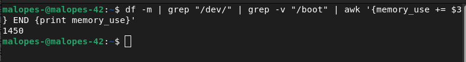

Para obter o espaço total, utilizaremos um comando muito semelhante. As únicas diferenças serão que os valores que adicionaremos serão os $2 em vez de $3 e a outra diferença é que no subject aparece o tamanho total em Gb, pelo que, como resultado da soma nos dá o número em Mb devemos transformá-lo em Gb, pois deve dividir-se o número entre 1024 e retirar as casas decimais.
`df -m | grep "/dev/" | grep -v "/boot" | awk '{memory_use += $2} END {print memory_use}'`

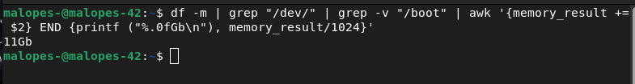

Finalmente, precisamos de mostrar uma porcentagem da memória utilizada. Para tal, mais uma vez, utilizaremos um comando muito semelhante aos dois anteriores. A única coisa que vamos mudar é que vamos combinar os dois comandos anteriores para termos duas variáveis, uma representando a memória utilizada e a outra o total. Uma vez feito isto, faremos uma operação para obter a porcentagem `use/total*100` e o resultado desta operação será impresso como aparece no subject, entre parênteses e com o símbolo % no final. O comando final é: `df -m | grep "/dev/" | grep -v "/boot" | awk '{use += $3} {total += $2} END {printf("%d%%"), use/total*100}`.

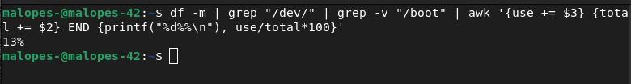

#### Porcentagem de utilização de CPU

Para ver a porcentagem de utilização de CPU faremos uso do comando `vmstat` que mostra as estatísticas do sistema, permitindo-nos obter um detalhe geral dos processos, utilização de memória, actividade de CPU, estado do sistema, etc. Poderemos colocar se não houver opção mas no meu caso colocarei um intervalo de segundos de 1 a 4. Também faremos uso do comando `tail -1` que nos permitirá produzir apenas a última linha, depois dos 4 gerados apenas a última será impressa. Finalmente, imprimiremos apenas a palavra 15 que é a utilização de memória disponível. O comando completo é o seguinte: `vmstat 1 4 | tail -1 | awk '{print $15}'`. O resultado deste comando é apenas uma parte do resultado final, uma vez que ainda é necessário fazer algumas operações para o obter corretamente. O que teríamos de fazer é subtrair de 100 o montante devolvido pelo nosso comando, o resultado desta operação será impresso com uma casa decimal e uma % no final e a operação será feita

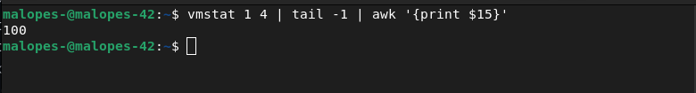

#### Último reinício

Para ver a data e hora do nosso último reboot utilizaremos o comando `who` com a bandeira -b porque com esta flag veremos a hora do último boot do sistema. Como já aconteceu antes, mostra-nos mais informação do que queremos, por isso filtraremos e mostraremos apenas aquilo em que estamos interessados, para o fazer utilizaremos o comando awk e compararemos se a primeira palavra de uma linha for "sistema" a terceira palavra dessa linha, um espaço e a quarta palavra será impressa no ecrã. Todo o comando seria o seguinte: `who -b | awk '$1 == "system" {print $3 " " $4}'`.

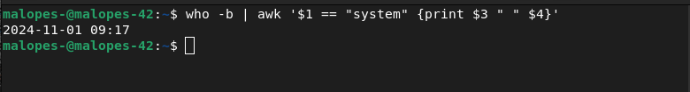

#### Utilização de LVM
Para verificar se o LVM está ou não ativo, utilizaremos o comando `lsblk`, que nos mostra informação de todos os dispositivos de bloco (discos rígidos, SSD, memórias, etc.) entre toda a informação que nos fornece, podemos ver o lvm no tipo de gestor. Basicamente a condição que procuramos é contar o número de linhas onde "lvm" aparece e se houver mais de 0 imprimimos Sim, se houver 0 imprimimos Não. O comando completo seria: `if [ $(lsblk | grep "lvm" | wc -l) -gt 0 ]; then echo yes; else echo no; fi`.

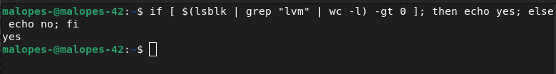

#### Conexões TCP
Para olhar para o número de ligações TCP estabelecidas. Utilizaremos o comando `ss` para substituir o comando obsoleto netstat. Filtrar com a flag `-ta` para que apenas as ligações TCP sejam mostradas. Finalmente, vamos ver quais são as que estão estabelecidas, uma vez que também existem as que só ouvem, e fechar com wc -l para contar o número de linhas. O comando é: `ss -ta | grep ESTAB | wc -l`.

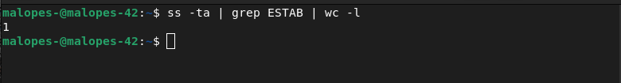

#### Número de utilizadores
Utilizaremos o comando users que nos mostrará o nome dos utilizadores, sabendo isto, configuraremos wc -w para contar o número de palavras na saída do comando. Todo o comando tem o seguinte: `users | wc -w`.

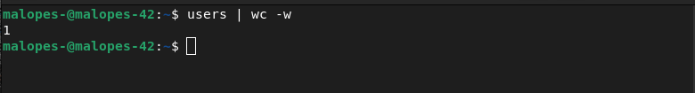

#### Endereço IP e MAC
Para obter o endereço do host utilizaremos o comando Hostname -I e para obter o endereço MAC utilizaremos o comando `ip link` que é utilizado para mostrar ou modificar as interfaces de rede. Como mais do que uma interface, aparecem os IP's, etc. Utilizaremos o comando grep para procurar o que queremos imprimir no ecrã apenas o que nos é pedido. Utilizaremos para mostrar apenas o endereço MAC: `ip link | grep "link/ether" | awk '{print $2}'`

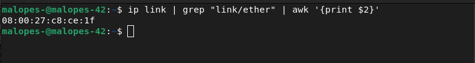

#### Número de comandos executados com sudo
Para obter o número de comandos que são executados com o sudo, utilizaremos o comando `journalctl`, que é uma ferramenta responsável pela recolha e gestão dos registos do sistema. Depois colocamos _COMM=sudo para filtrar as entradas, especificando o seu caminho. No nosso caso, colocamos _COMM, uma vez que se refere a um script executável. Depois de filtrarmos a pesquisa e só aparecerem os logs do sudo, ainda temos de filtrar um pouco mais porque quando se faz o log in ou log out como root também aparece no log, então para terminar a filtragem colocaremos um grep COMMAND e assim só aparecem as linhas de comando. Finalmente, colocaremos wc -l para que as linhas sejam listadas. O comando completo é o seguinte: `journalctl _COMM=sudo | grep COMMAND | wc -l`). Para verificar se funciona correctamente, podemos executar o comando no terminal, colocar um comando que inclui o sudo e executar novamente o comando e este deve aumentar o número de execuções de sudo.

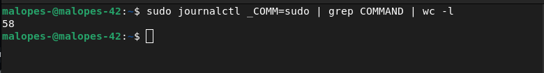

#### Resultado total do script

```javascript
#!/bin/bash

# ARCH
arch=$(uname -a)

# CPU PHYSICAL
cpuf=$(grep "physical id" /proc/cpuinfo | wc -l)

# CPU VIRTUAL
cpuv=$(grep "processor" /proc/cpuinfo | wc -l)

# RAM
ram_total=$(free --mega | awk '$1 == "Mem:" {print $2}')
ram_use=$(free --mega | awk '$1 == "Mem:" {print $3}')
ram_percent=$(free --mega | awk '$1 == "Mem:" {printf("%.2f"), $3/$2*100}')

# DISK
disk_total=$(df -m | grep "/dev/" | grep -v "/boot" | awk '{disk_t += $2} END {printf ("%.1fGb\n"), disk_t/1024}')
disk_use=$(df -m | grep "/dev/" | grep -v "/boot" | awk '{disk_u += $3} END {print disk_u}')
disk_percent=$(df -m | grep "/dev/" | grep -v "/boot" | awk '{disk_u += $3} {disk_t+= $2} END {printf("%d"), disk_u/disk_t*100}')

# CPU LOAD
cpul=$(vmstat 1 2 | tail -1 | awk '{printf $15}')
cpu_op=$(expr 100 - $cpul)
cpu_fin=$(printf "%.1f" $cpu_op)

# LAST BOOT
lb=$(who -b | awk '$1 == "system" {print $3 " " $4}')

# LVM USE
lvmu=$(if [ $(lsblk | grep "lvm" | wc -l) -gt 0 ]; then echo yes; else echo no; fi)

# TCP
tcpc=$(ss -ta | grep ESTAB | wc -l)

# USER LOG
ulog=$(users | wc -w)

# NETWORK
ip=$(hostname -I)
mac=$(ip link | grep "link/ether" | awk '{print $2}')

# SUDO
cmnd=$(journalctl _COMM=sudo | grep COMMAND | wc -l)

wall -t tty1 "	Architecture: $arch
	CPU physical: $cpuf
	vCPU: $cpuv
	Memory Usage: $ram_use/${ram_total}MB ($ram_percent%)
	Disk Usage: $disk_use/${disk_total} ($disk_percent%)
	CPU load: $cpu_fin%
	Last boot: $lb
	LVM use: $lvmu
	Connections TCP: $tcpc ESTABLISHED
	User log: $ulog
	Network: IP $ip ($mac)
	Sudo: $cmnd cmd"
```

Deve exibir algo assim:
Note que estou no root

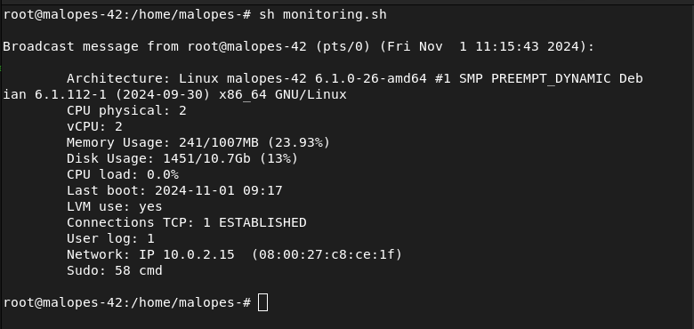