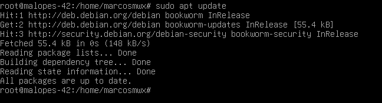
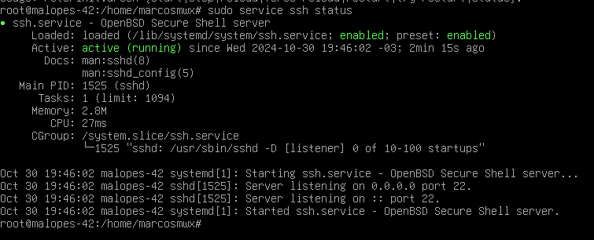
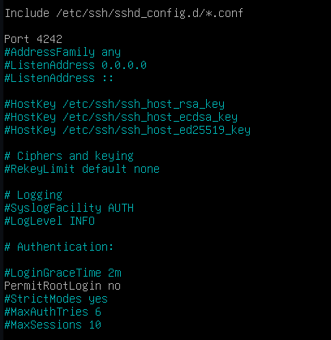
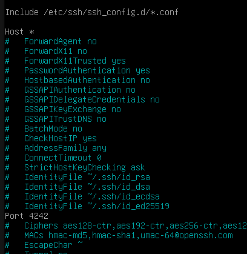
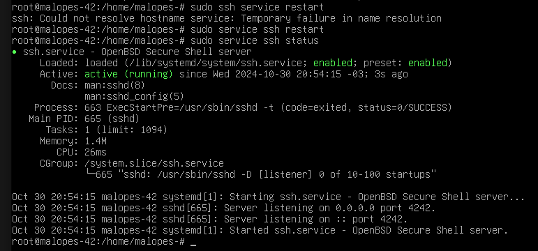

# Instalação e configuração do SSH 📶

## 🧠 O que é SSH❓ 

É o nome de um protocolo e do programa que o implementa, cuja função principal é o acesso remoto a um servidor através de um canal seguro no qual toda a informação é encriptada.

1. A primeira coisa que faremos é `sudo apt update` para atualizar os repositórios por nós definidos no ficheiro /etc/apt/sources.list

2. A seguir instalaremos a principal ferramenta de conectividade para o login remoto com o protocolo SSH, esta ferramenta é OpenSSH. Para a instalar, introduza o comando `sudo apt install openssh-server`. Na mensagem de confirmação coloque Y, depois aguarde que a instalação termine.
3. Para verificar se foi instalado correctamente, faremos o `sudo service ssh status` e este deve mostrar-se ativo.

4. Uma vez terminada a instalação, foram criados alguns ficheiros que temos de configurar. Para tal, utilizaremos `Nano` ou se preferir outro editor de texto. O primeiro ficheiro a editar é `/etc/ssh/sshd_config`. Se não estiver no utilizador root não terá permissões de escrita, para isso faremos `su` e colocaremos a palavra-passe para introduzir o utilizador root ou se não quiser introduzir o utilizador root colocar sudo no início do comando sudo nano `/etc/ssh/sshd_config`.

5. O # no início de uma linha significa que é comentado, as linhas que vamos modificar devem remover o comentário. Uma vez editado o ficheiro, devemos modificar as seguintes linhas:
- Port 22 -> Port 4242
- PermitRootLogin prohibit-password -> PermitRootLogin no

6. Agora no ficheiro ficheiro `/etc/ssh/ssh_config`. 
- Port 22 -> Port 4242

7. Finalmente, temos de reiniciar o serviço ssh para actualizar as modificações que acabámos de fazer. Para o fazer, devemos digitar o comando `sudo service ssh restart` e, uma vez reiniciado, vamos olhar para o estado actual com sudo service ssh status e para confirmar que as alterações foram feitas no ouvinte do servidor, a porta 4242 deve aparecer.

