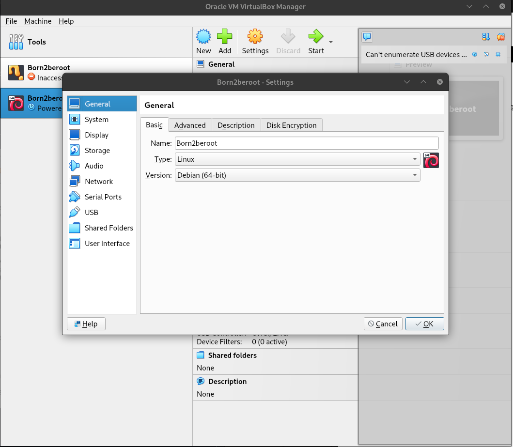
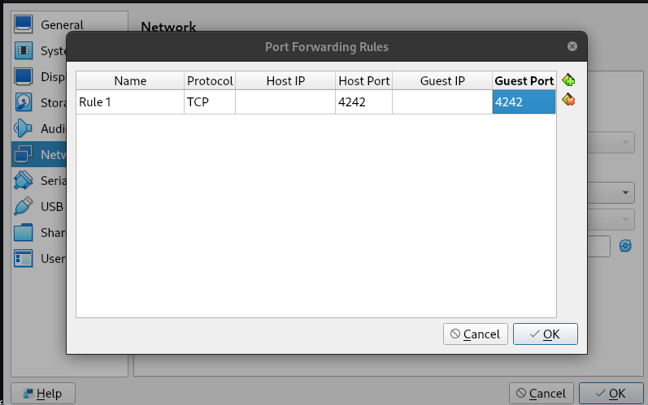
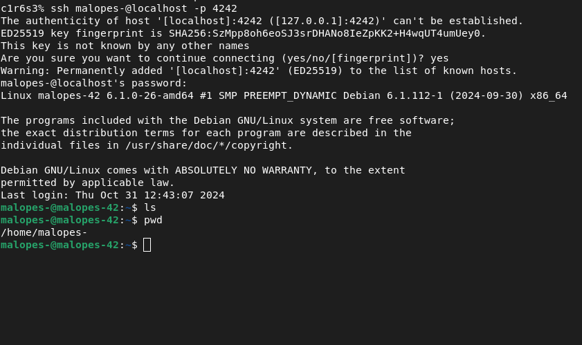

# Conexão via SSH 🗣

#### Configuração via ssh

1. Para ligar via SSH temos de fechar a máquina, abrir a VirtualBox e clicar na configuração.

2.  Uma vez na `Configurations` devemos clicar na seção `Network` , clicar em `Advanced` para nos mostrar mais opções e clicar em `Port Fowarding`.
3. Clique no emoticon verde para adicionar uma `Adds New Port Fowarding Rule` .
4.  Acrescentaremos a porta 4242 ao host e convidado. Os IP's não são necessários. Clique no botão de aceitação para aplicar as alterações.

5. Para nos podermos conectar à máquina virtual a partir da máquina real, temos de abrir um terminal na máquina real e escrever `ssh malopes-@localhost -p 4242`, colocar a password do utilizador e assim que a introduzirmos veremos o login a verde e isso significa que estaremos logados. (Ligue a maquina virtual e coloque a senha do root)

