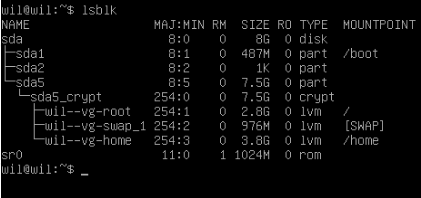
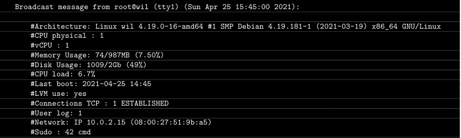
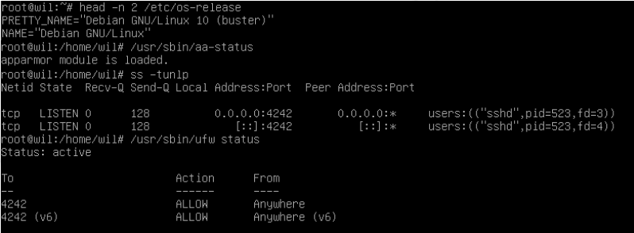
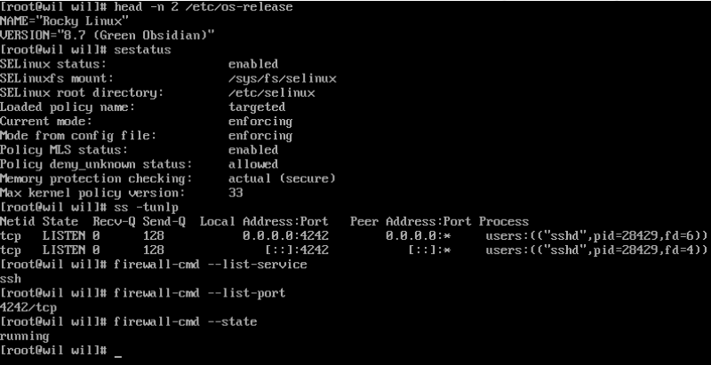

# Subject traduzido do que deve ser feito na parte mandatoria

##### Entendendo o que tem que ser feito

Criar máquina virtual utilizando o VirtualBox ou UTM (Se o VB não estiver diponível)
Só é preciso entregar um arquivo subscription.txt na raiz do repositório. Você
deve colar nele a assinatura do disco virtual da sua máquina.
:::danger[Atenção]
Instale o mínimo de recursos possíveis e interface gráfica é um recurso não permitido!
:::
Escolher entre dois tipos de SO (Sistema Operacional), Rocky ou Debian (versão estavel)

:::warning[Atenção]
Instalar o rocky pode ser mais complexo que o debian então você deverá utilizar SELinux na inicialização, assim como o Debian o AppArmor deve estar rodando na inicialização.
:::

Você deve criar pelo menos 2 partições criptografadas usando LVM. Abaixo está um exemplo do
particionamento esperado:

:::warning[Se liga]
Durante a defesa, serão feitas algumas perguntas sobre o
sistema operacional que você escolheu. Por exemplo, você deve saber o
diferenças entre aptitude e apt, ou o que SELinux ou AppArmor
é. Resumindo, entenda o que você usa!
:::

:::danger[Se liga]
Um serviço SSH estará em execução na porta obrigatória 4242 da sua máquina virtual.
Por razões de segurança, não deve ser possível conectar-se usando SSH como root
:::

:::warning[Se liga]
Um serviço SSH estará em execução na porta obrigatória 4242 da sua máquina virtual.
Por razões de segurança, não deve ser possível conectar-se usando SSH como root
O uso do SSH será testado durante a defesa através da criação de uma nova conta. Você deve, portanto, entender como funciona    
:::

:::danger[Se liga]
Você tem que configurar seu sistema operacional com o UFW (ou firewalld para Rocky) firewall e, portanto, deixe apenas a porta 4242 aberta em sua máquina virtual.
Seu firewall deve estar ativo quando você inicia sua máquina virtual.
Para Rocky, você deve usar firewalld em vez de UFW
:::

• O nome do host da sua máquina virtual deve ser o seu login terminando em 42 (por exemplo, wil42). Você terá que modificar esse nome de host durante sua avaliação.
• Você precisa implementar uma política de senha forte.
• Você deve instalar e configurar o sudo seguindo regras estritas.
• Além do usuário root, um usuário com seu login como nome de usuário deve estar presente.
• Este usuário deve pertencer aos grupos user42 e sudo.

:::warning[Se liga]
Durante a defesa, você terá que criar um novo usuário e atribuí-lo para um grupo
:::

Para configurar uma política de senha forte, você deve cumprir os seguintes requisitos:
comentários:
• Sua senha expira a cada 30 dias.
• O número mínimo de dias permitido antes da modificação de uma senha será ser definido como 2.
• O usuário deverá receber uma mensagem de aviso 7 dias antes de sua senha expirar.
• Sua senha deve ter pelo menos 10 caracteres. Deve conter letras maiúsculas letra, uma letra minúscula e um número. Além disso, não deve conter mais de 3 caracteres idênticos consecutivos.
• A senha não deve incluir o nome do usuário.
• A seguinte regra não se aplica à senha root: A senha deve ter pelo menos 7 caracteres que não fazem parte da senha anterior.
• Claro, sua senha root deve estar em conformidade com esta política

:::danger[Atenção]
Depois de configurar seus arquivos de configuração, você terá que alterar todas as senhas das contas presentes na máquina virtual, incluindo a conta root.
:::

Para definir uma configuração forte para o seu grupo sudo, você deve cumprir o seguintes requisitos:
• A autenticação usando sudo deve ser limitada a 3 tentativas em caso de erro senha correta.
• Uma mensagem personalizada de sua escolha deverá ser exibida se ocorrer um erro devido a um erro a senha ocorre ao usar o sudo.
• Cada ação usando sudo deve ser arquivada, tanto as entradas quanto as saídas. O arquivo de registro deve ser salvo na pasta /var/log/sudo/.
• O modo TTY deve estar ativado por motivos de segurança.
• Também por razões de segurança, os caminhos que podem ser usados ​​pelo sudo devem ser restritos.
Exemplo:
/usr/local/sbin:/usr/local/bin:/usr/sbin:/usr/bin:/sbin:/bin:/snap/bin

Finalmente, você deve criar um script simples chamado monitoring.sh. Deve ser desenvolvido no bash.
Na inicialização do servidor, o script exibirá algumas informações (listadas abaixo) sobre todos os terminais a cada 10 minutos ("take a look at wall"). O banner é opcional. Não deve exibir erros.
Seu script deve ser capaz de exibir as seguintes informações:
• A arquitetura do seu sistema operacional e sua versão do kernel.
• O número de processadores físicos.
• O número de processadores virtuais.
• A RAM atualmente disponível em seu servidor e sua taxa de utilização como porcentagem.
• O armazenamento atualmente disponível em seu servidor e sua taxa de utilização como porcentagem.
• A taxa de utilização atual dos seus processadores como uma porcentagem.
• A data e hora da última reinicialização.
• Se o LVM está ativo ou não.
• O número de conexões ativas.
• O número de usuários que utilizam o servidor.
• O endereço IPv4 do seu servidor e seu endereço MAC (Media Access Control).
• O número de comandos executados com o programa sudo.

:::warning[Se liga]
Durante a defesa, você deverá explicar como esse roteiro funciona. Você também terá que interrompê-lo sem modificá-lo.
Dê uma olhada no cron.
:::

Exemplo de como o script deve ser exibido:

Abaixo estão dois comandos que você pode usar para verificar alguns dos requisitos do assunto:
Para Debian:

Para Rcoky:

Até aqui é a parte Mandatoria após isso é a BONUS PART.