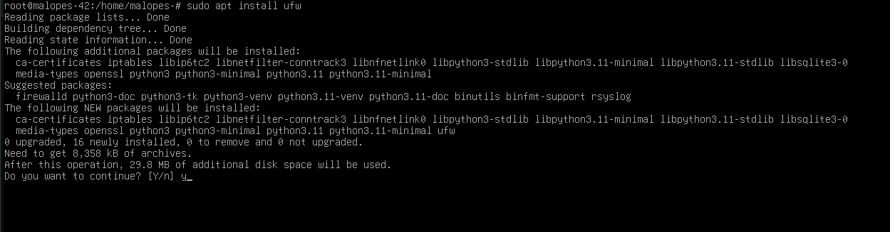
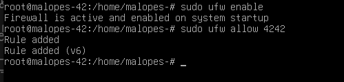
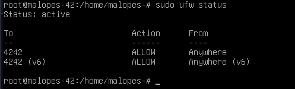

# Instalação e configuração de UFW 🔥🧱

## 🧠 O que é UFW❓

É um [firewall](https://es.wikipedia.org/wiki/Cortafuegos_(inform%C3%A1tica)) que utiliza a linha de comando para configurar iptables utilizando um pequeno número de comandos simples.
*Iptables é um programa de firewall que configura regras para o protocolo IPv4 em sistemas Linux. Ele atua como uma espécie de "guarda de fronteira" entre o computador e a internet, monitorando o tráfego de entrada e saída do servidor.*

1. A primeira coisa a fazer é instalar o `UFW`, para o fazer utilizaremos o comando `sudo apt install ufw`, depois escreveremos um `y` para confirmar que o queremos instalar e esperar que termine.

2. Uma vez instalada, devemos ativá-la, para o fazer devemos colocar o seguinte comando `sudo ufw enable` e depois devemos indicar que a firewall está ativa.

3. Agora o que precisamos de fazer é permitir que a nossa firewall permita ligações através da porta 4242. Fá-lo-emos com o seguinte comando `sudo ufw allow 4242`.

4. Finalmente, verificaremos se tudo está correctamente configurado, olhando para o estado da nossa firewall, onde as ligações através da porta 4242 já devem aparecer como permitidas. Para ver o estado, utilizaremos o comando `sudo ufw status`.

