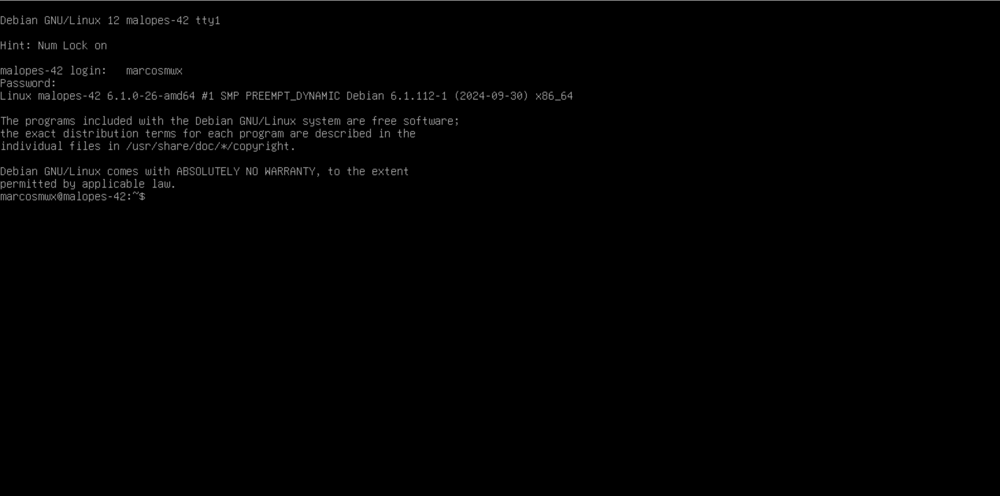

# Configuração de máquina virtual ⚙️

#### Vamos configurar a maquina virtual de acordo com o subject

A primeira coisa a fazer é seleccionar Debian GNU/Linux.

1. Temos de introduzir a palavra-passe de encriptação que utilizámos anteriormente. No meu caso, é 123@Mwx.
2. Temos de introduzir o utilizador e a palavra-passe que criámos. No meu caso, o utilizador é marcosmwx e a palavra-chave 123@Mwx.

3. 