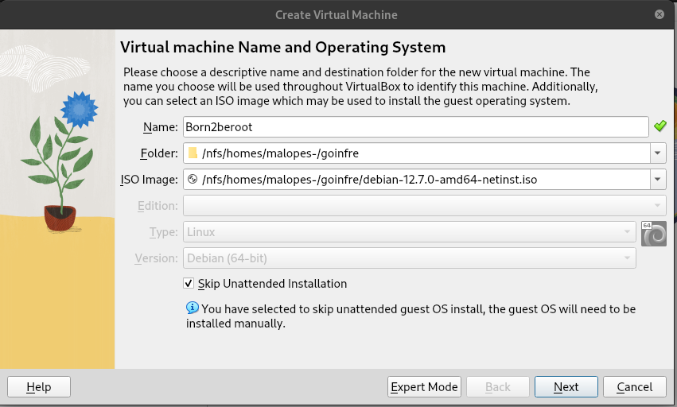
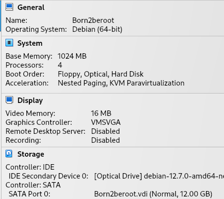

# 🖥️ Virtual Box

### Primeiro passo para criar a sua maquina Virtual

Etendendo alguns conceitos:

Máquinas virtuais são computadores dentro de computadores. O "Virtual" quer dizer que não existem equipamentos FÍSICOS (hardware) diferentes e dedicados para cada uma das máquinas virtuais; significa que o computador que hospeda a(s) máquina(s) virtual(is) divide os seus recursos com as máquinas virtuais em si. O computador continua tendo um único HD, uma única placa Mãe, etc., mas quando você configura e cria uma máquina virtual dentro do computador, agora é como se existissem dois computadores compartilhando o espaço/memória/capacidades de um computador só. E no caso da WSL (Windows Subsystem for Linux, ou o Linux instalado dentro do Windows), enquanto estou logado no meu PC usando o Windows, consigo acessar a minha máquina virtual de Ubuntu pelo VSCode, por exemplo.

[Fonte - Acelera — Born2BeRoot](https://rodsmade.notion.site/Acelera-Born2BeRoot-99adac7a7bdc4bbf81b4eaf977625d5c)

É necessário um software de virtualização para realizar a instalação. Neste Guia usaremos o VirtualBox.

Softwares necessários para prosseguir : [VirtualBox](https://www.virtualbox.org/) e [Debian](https://www.debian.org/download.en.html).

1. Abra a VirtualBox e clique em Novo (New)

2.  Escolha o nome da sua máquina e a pasta onde ela estará localizada. É importante colocar a máquina dentro da pasta sgoinfre, porque se não a colocarmos lá ficaremos sem espaço e a instalação falhará (dependendo do campus, o caminho sgoinfre pode mudar).

3. Selecione a quantidade de RAM que deseja reservar para a máquina. (1024) e (12GB) para Virtual Disk
