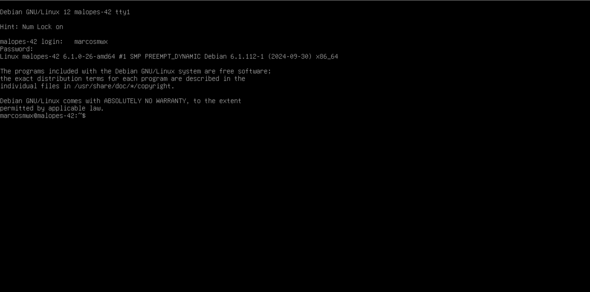
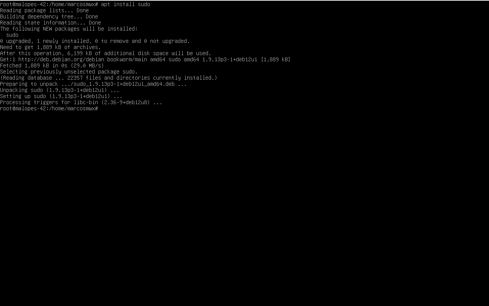
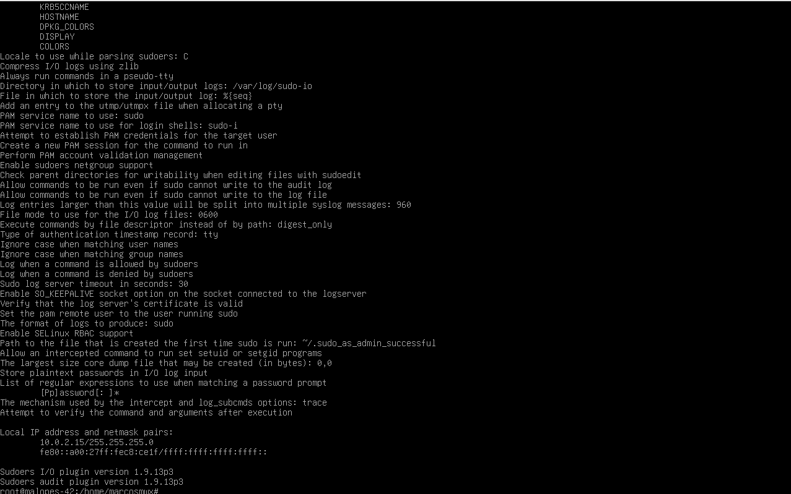
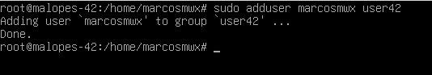
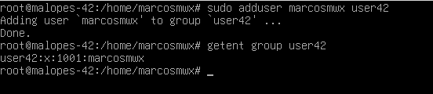

# Configuração de máquina virtual ⚙️

#### Vamos configurar a maquina virtual de acordo com o subject

A primeira coisa a fazer é seleccionar Debian GNU/Linux.

1. Temos de introduzir a palavra-passe de encriptação que utilizámos anteriormente. No meu caso, é 123@Mwx.
2. Temos de introduzir o utilizador e a palavra-passe que criámos. No meu caso, o utilizador é marcosmwx e a palavra-chave 123@Mwx. (Coloque o seu nome da intra)

3. Para instalar o sudo primeiro temos de estar no utilizador raiz, para isso vamos colocar Su no terminal e introduzir a palavra-passe, no meu caso é Hola42bcn. Uma vez que tenhamos acedido ao utilizador root, devemos colocar o comando apt install sudo para instalar os pacotes necessários.
Precisamos de reiniciar a máquina para que as alterações produzam efeito. Para tal, utilizar o comando sudo reboot e esperar que a máquina reinicie. `sudo reboot`

4. Uma vez reiniciada, devemos reintroduzir a encriptação e as palavras-passe dos utilizadores. Para verificar se instalámos correctamente o sudo, voltaremos a entrar no utilizador root e introduziremos o comando sudo -V, este comando para além de nos mostrar a versão do sudo também nos mostrará os argumentos passados para configurar quando o sudo foi criado e os plugins que podem mostrar informações mais detalhadas. (Opcional) ➤ Uma vez que a saída do comando é muito longa, se o quisermos ver completamente, devemos redireccionar a saída do comando para um ficheiro sudo -V > file.txt e depois editar o arquivo `nano file.txt`. Ou colocar | more após o comando.

5. Continuando no utilizador root criaremos um utilizador com o nosso login com o comando sudo adduser login, pois já criámos o utilizador na instalação, devemos ver que o utilizador já existe.

6. Agora precisamos de criar um novo grupo chamado user42. Para o criar, faça `sudo addgroup user42`.
Não se esqueça de colocar o usuário no sudo group.

:::tip[🧠 O que é GID❓]
É o Identificador do Grupo, abreviatura de Group Identifier 🆔.
O grupo foi criado correctamente? A verdade é que se não tiver havido qualquer mensagem de erro, ainda podemos verificar se foi criada com o comando getent group nome_do_grupo ou também podemos fazer cat /etc/group e podemos ver todos os grupos e os utilizadores dentro deles.
:::

7. Com o comando sudo adduser group, iremos incluir o utilizador no grupo. Devemos incluir o utilizador nos grupos sudo e user42.

8. Depois de os termos introduzido para verificar se tudo foi feito correctamente, podemos executar o comando getent group group_name ou podemos também editar o ficheiro /etc/group nano /etc/group e nos grupos sudo e login42 o nosso utilizador deve aparecer.

9. Eu fiz errado então mudei o meu usuario de marcosmwx para malopes- (intra name). Hu3!.
coloquei no grupo user42 e sudo como diz o subject.

