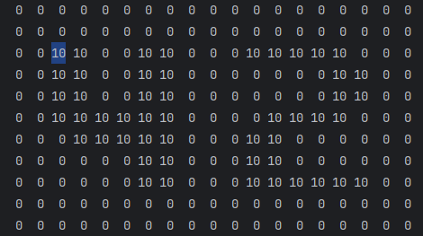

# Lendo mapas
:::danger[HEHE]
O motivo de eu nao estar utilizando minha propria ft_printf e porque esqueci ela na 42 e estou fazendo essa doc em casa, vlw flw..
:::

Vamos começar escrevendo o `fdf.h` que conterá nossas funções principais e struct:
### Header do FdF
```C fdf.h
#ifndef FDF_H
# define FDF_H

#include "minilibx-linux/mlx.h"
# include "libft/libft.h"
# include <stdlib.h>
# include <stdio.h>
# include <unistd.h>

// Estrutura que contém os dados do mapa e ponteiros para a janela gráfica
typedef struct
{
    int    width;      // Largura do mapa (número de colunas)
    int    height;     // Altura do mapa (número de linhas)
    int    **z_matriz; // Matriz que armazena os valores de altura (altitude)

    void    *mlx_ptr;  // Ponteiro para a instância do MiniLibX
    void    *win_ptr;  // Ponteiro para a janela aberta no MiniLibX
}    fdf;

// Declaração da função que lê o arquivo e preenche a STRUCT acima `fdf`
void    read_file(char *file_name, fdf *data);

#endif
```

### Main para leitura de arquivo (mapa)

```C
int main(int argc, char **argv)
{
    fdf *data;

    // Faz a alocação da struct `fdf`
    data = (fdf*)malloc(sizeof(fdf));

    // Chama a função que lê o arquivo e preenche a struct `data`
    read_file(argv[1], data);

    // Variáveis auxiliares para iterar pela matriz
    int i = 0;
    int j = 0;

    // Itera sobre as linhas da matriz
    while (i < data->height)
    {
        j = 0; // Reseta `j` para iterar sobre as colunas de cada linha
        while (j < data->width)
        {
            // Imprime o valor da matriz formatado com 3 espaços de largura
            printf("%3d", data->z_matriz[i][j]);
            j++;
        }
        printf("\n");
        i++;
    }
    free(data);
}
```
### Função auxiliar para pegar a Altura
Esta função calcula o número de linhas do arquivo.
Note que como não vou fazer nada com a linha lida eu apenas dou free o que importa é a quantidade de linhas.
```C
int get_height(char *file_name)
{
    char *line;
    int fd;
    int height;

    fd = open(file_name, O_RDONLY, 0);
    if (fd < 0)
        return -1; // Retorna -1 em caso de erros de abertura.

    height = 0;

    // Lê o arquivo linha por linha e conta as linhas / SDDS WC -l =/
    while ((line = get_next_line(fd)) != NULL)
    {
        height++;
        free(line);
    }

    close(fd);
    return height;
}

```
### Função auxiliar para pegar a Largura

Calcula o número de palavras na primeira linha do arquivo, que corresponde à largura do mapa.

Note que o mapa é um quadrado então nao preciso percorrer cada linha e verificar se cada linha é igual o numero de "palavras"
```C
int get_width(char *file_name)
{
    int width;
    int fd;
    char *line;

    fd = open(file_name, O_RDONLY, 0);
    line = get_next_line(fd);
    if (line == NULL)
    {
        write(1, "Erro line get_width", 19);
        return -1;
    }
 // Usa `ft_wdcounter` para contar as palavras, voce deve ter essa função na split..
    width = ft_wdcounter(line, ' ');

    free(line);
    close(fd);
    return width;
}
```

### Função auxiliar para pegar dimensao exata onde esta o valor
Digamos que é a posição de cada numero exibido

exemplo : o primeiro `0` do mapa da outra pagina esta na posição z_matriz[0][0]
ou seja se voce acessar z_matriz[0][0] voce vai obter 0.

outros exemplos:
```
z_matriz[0][0] = 0;

z_matriz[0][1] = 0;

z_matriz[2][3] = 10;
```

se voce nao tive preguicar e testar :
`printf("%d", data->z_matriz[2][3]);`

voce vai ter esta posição marcada:



isso que essa função faz.. tirando a parte de exibir ne.. voce entendeu..

```C
void fill_matriz(int *z_line, char *line)
{
    char **nums;
    int i = 0;

    // Divide a linha em substrings usando o separador de espaço
    nums = ft_split(line, ' ');
    if (!nums) {
        write(1, "Erro: ft_split retornou NULL.\n", 30);
        return;
    }

    // Converte cada substring em um número e armazena na linha `z_line`
    while (nums[i])
    {
        z_line[i] = ft_atoi(nums[i]);
        free(nums[i]);
        i++;
    }
    free(nums);
}
```

### Função para de fato ler o mapa

Lê o arquivo de entrada e preenche a estrutura fdf com os dados do mapa.

```C
void    read_file(char *file_name, fdf *data)
{
    int    fd;
    int    i;
    char   *line;

    //pega a altura e largura (dimensões do mapa)
    data->height = get_height(file_name);
    data->width = get_width(file_name);

    // Aloca a matriz `z_matriz` com base na altura e largura
    data->z_matriz = (int **)malloc(sizeof(int*) * data->height);
    if (!data->z_matriz)
    {
        write(1, "Erro malloc z_matriz", 20);
        return;
    }
    i = -1;
    // Aloca espaço para cada linha da matriz (dados de cada linha do mapa)
    while (++i < data->height)
        data->z_matriz[i] = (int *)malloc(sizeof(int) * (data->width));
    fd = open(file_name, O_RDONLY, 0);
    i = 0;
    // Lê cada linha do arquivo e preenche a matriz com os valores das posições
    while ((line = get_next_line(fd)) != NULL)
    {
        fill_matriz(data->z_matriz[i], line, data->width);
        free(line);
        i++;
    }
    close(fd);
}
```


